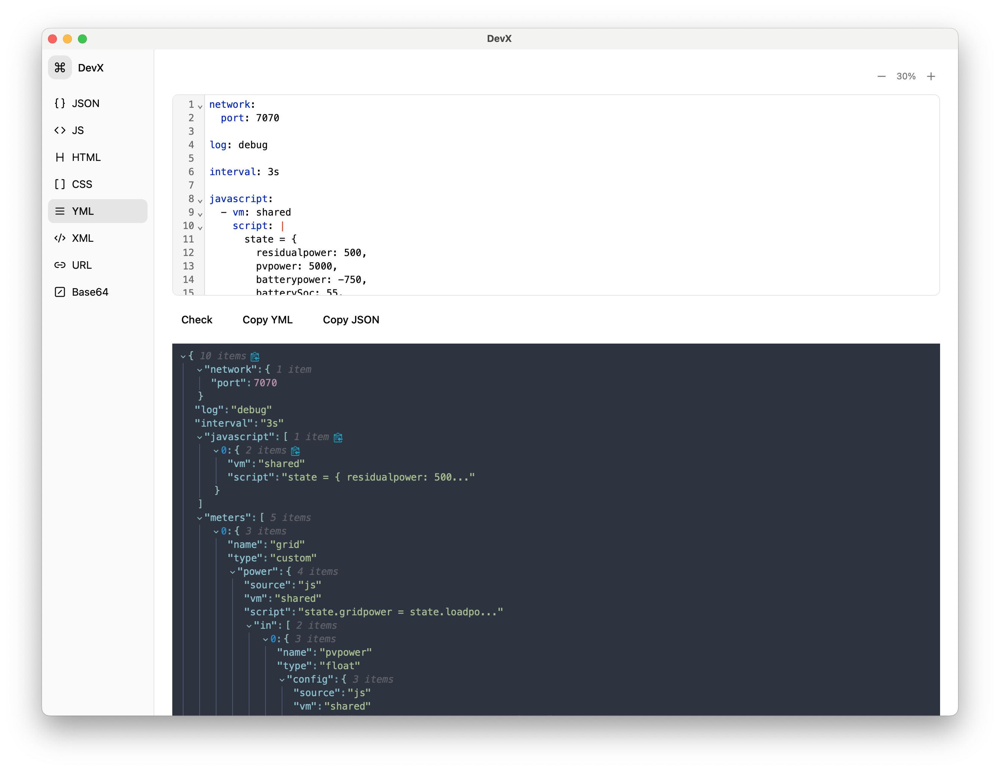

# DevX

一个开发者工具集，提供代码格式化、编码转换等功能。



## 功能特性

- 🔧 **代码格式化**: JSON, HTML, CSS, JavaScript, XML, YAML
- 🔄 **编码转换**: Base64, URL 编码/解码
- 🎨 **现代化 UI**: 基于 Tailwind CSS 的美观界面
- 🖥️ **跨平台**: Windows, macOS, Linux 桌面应用
- ⚡ **高性能**: 基于 Tauri 和 Rust 构建
- 🍎 **App Store 支持**: 支持 macOS App Store 发布

## 快速开始

### 开发环境

```bash
# 克隆仓库
git clone <repository-url>
cd devx

# 安装依赖
pnpm install

# 启动开发服务器
pnpm dev

# 构建应用
pnpm tauri build
```

### 发布版本

使用自动化发布脚本：

```bash
# 发布新版本（GitHub Release）
./scripts/release.sh 1.0.0

# 发布到 App Store
./scripts/appstore-release.sh 1.0.0
```

或者手动创建标签：

```bash
# GitHub Release
git tag v1.0.0
git push origin v1.0.0

# App Store Release
git tag appstore-v1.0.0
git push origin appstore-v1.0.0
```

## CI/CD 流程

本项目使用 GitHub Actions 进行自动化构建和发布：

### 工作流

1. **CI 检查** (`.github/workflows/ci.yml`)
   - 代码质量检查
   - 多平台构建测试
   - 触发条件：推送到 main/develop 分支或 PR

2. **Release 发布** (`.github/workflows/release.yml`)
   - 多平台应用构建（带代码签名）
   - 自动创建 GitHub Release
   - 触发条件：推送版本标签或手动触发

3. **App Store 发布** (`.github/workflows/appstore.yml`)
   - macOS 应用构建和签名
   - 自动上传到 App Store Connect
   - 触发条件：推送 appstore-* 标签

### 支持的平台

- **Windows**: MSI 安装包
- **macOS**: Intel 和 Apple Silicon DMG 安装包（已签名和公证）
- **Linux**: AppImage
- **App Store**: macOS 应用（支持 Intel 和 Apple Silicon）

### 构建产物

每次发布会自动生成以下文件：
- `devx-windows-x64.msi`
- `devx-macos-x64.dmg` (已签名和公证)
- `devx-macos-arm64.dmg` (已签名和公证)
- `devx-linux-x64.AppImage`

## 代码签名和 App Store 发布

### 代码签名
- 支持 macOS 开发者 ID 签名
- 自动公证流程
- 绕过 Gatekeeper 安全限制

### App Store 发布
- 自动构建 Universal macOS 应用
- 集成 App Store Connect API
- 支持自动上传到 App Store Connect

详细的配置指南请参考 [APPSTORE_SETUP.md](./APPSTORE_SETUP.md)

## 开发指南

### 项目结构

```
devx/
├── src/                    # 前端源码
│   ├── apps/              # 应用功能模块
│   ├── components/        # UI 组件
│   └── ...
├── src-tauri/             # Tauri 后端
│   ├── tauri.conf.json    # 主配置文件
│   ├── tauri.appstore.conf.json # App Store 配置
│   ├── entitlements.plist # 权限配置
│   └── entitlements.appstore.plist # App Store 权限
├── .github/workflows/     # GitHub Actions
├── scripts/               # 构建脚本
└── ...
```

### 技术栈

- **前端**: React + TypeScript + Tailwind CSS
- **后端**: Rust + Tauri
- **构建**: Vite + pnpm
- **CI/CD**: GitHub Actions
- **代码签名**: Apple Developer Program

### 代码规范

- 使用 TypeScript 进行类型检查
- 遵循 ESLint 规则
- 使用 Prettier 格式化代码
- 提交信息遵循 Conventional Commits

## 发布流程

详细的发布流程请参考 [RELEASE.md](./RELEASE.md)

## 贡献指南

1. Fork 项目
2. 创建功能分支 (`git checkout -b feature/AmazingFeature`)
3. 提交更改 (`git commit -m 'Add some AmazingFeature'`)
4. 推送到分支 (`git push origin feature/AmazingFeature`)
5. 创建 Pull Request

## 许可证

本项目采用 MIT 许可证 - 查看 [LICENSE](LICENSE) 文件了解详情。

## 更新日志

查看 [CHANGELOG.md](./CHANGELOG.md) 了解版本更新历史。

## 开发

### 环境要求

- Node.js 20+
- Rust 1.70+
- pnpm

### 安装依赖

```bash
pnpm install
```

### 开发模式

```bash
pnpm dev
```

### 构建

```bash
pnpm build
```

### 版本管理

项目提供了完整的版本管理脚本：

```bash
# 检查当前版本一致性
./scripts/check-versions.sh

# 测试版本更新功能
./scripts/test-version-update.sh

# 发布新版本（会自动更新所有版本文件）
./scripts/release.sh 1.0.0
```

### 发布

详细的发布流程请参考 [RELEASE.md](RELEASE.md)。
